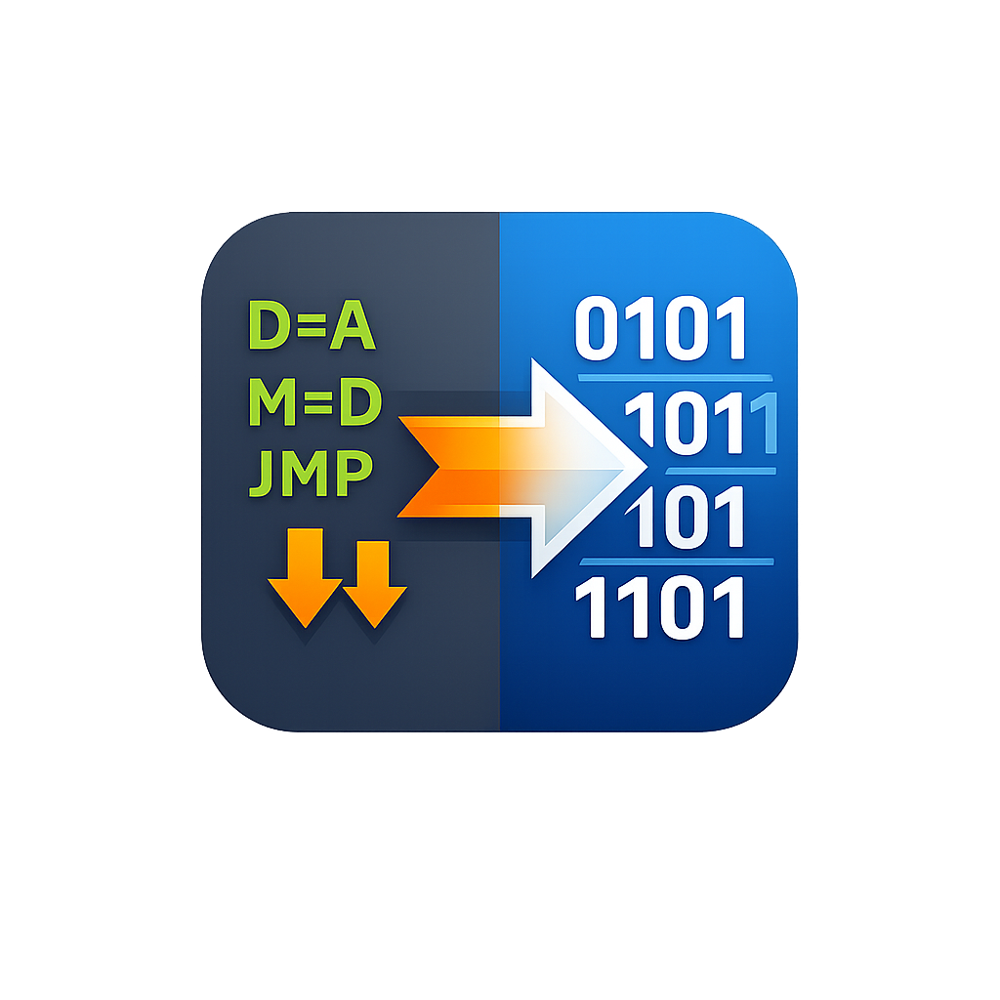

# HackAssembler

<p align="center">
  
</p>

A Hack machine language assembler written in C# and targeting `.hack` output files.

It takes a Hack assembly source file such as `Prog.asm` and generates `Prog.hack`.
If the input is a folder, it assembles every `.asm` file in that folder.

## Requirements

- .NET 10 SDK to build, test, or run from source
- If you publish as `self-contained`, the target machine does not need a .NET runtime
- If you publish as `framework-dependent`, the target machine needs the matching .NET 10 runtime

## Branding Assets

The repository includes logo and icon assets derived from the project branding:

- `assets/image.png`: source logo image
- `assets/logo.png`: raster logo
- `assets/app.ico`: Windows executable icon
- `assets/app.png`: Linux launcher icon
- `assets/app.iconset/`: macOS iconset PNGs for app bundle packaging
- `assets/app.icns`: macOS icon file when generation succeeds on the local machine

The Windows project file is already configured to use `assets/app.ico` for release builds.

## Build

```bash
dotnet build HackAssembler.slnx
```

## Test

```bash
dotnet test HackAssembler.slnx
```

## Run From Source

Show help:

```bash
dotnet run --project HackAssembler/HackAssembler.csproj -- --help
```

Assemble a file and write the `.hack` output next to the source file:

```bash
dotnet run --project HackAssembler/HackAssembler.csproj -- path/to/Prog.asm
```

Assemble every `.asm` file in a folder:

```bash
dotnet run --project HackAssembler/HackAssembler.csproj -- path/to/programs
```

Assemble a file and choose the output directory:

```bash
dotnet run --project HackAssembler/HackAssembler.csproj -- path/to/Prog.asm path/to/output
```

Assemble every `.asm` file in a folder and choose the output directory:

```bash
dotnet run --project HackAssembler/HackAssembler.csproj -- path/to/programs path/to/output
```

Continue assembling the rest of a folder after one file fails:

```bash
dotnet run --project HackAssembler/HackAssembler.csproj -- --continue-on-error path/to/programs path/to/output
```

## CLI Usage

```text
hack-assembler [--continue-on-error] <path-to-file-or-folder> [output-directory]
```

- `<path-to-file-or-folder>`: path to the input `.asm` file, or a folder containing `.asm` files
- `[output-directory]`: optional destination folder for the generated `.hack` file
- `--continue-on-error`: continue assembling the remaining `.asm` files when one fails

Example:

```bash
hack-assembler ./Add.asm
hack-assembler ./Fill.asm ./build
hack-assembler ./programs
hack-assembler ./programs ./build
hack-assembler --continue-on-error ./programs ./build
```

If the input file is `Fill.asm`, the generated file will be `Fill.hack`.
If the input path is a folder, every `.asm` file in that folder is assembled.
By default the command stops on the first failure. With `--continue-on-error`, it keeps going and exits with a non-zero status if any file failed.

## Progress Loader

When you run the CLI in an interactive terminal, it shows a small spinner while files are being assembled. The loader is automatically suppressed when output is redirected, so it does not pollute scripts or test output.

## Publish Standalone Executables

The commands below create single-file, self-contained executables in a local `publish/` folder.

### Linux x64

```bash
dotnet publish HackAssembler/HackAssembler.csproj \
  -c Release \
  -r linux-x64 \
  --self-contained true \
  -p:PublishSingleFile=true \
  -o ./publish/linux-x64
```

Generated executable:

```bash
./publish/linux-x64/HackAssembler
```

Linux launcher icon:

```text
assets/app.png
```

### Windows x64

```powershell
dotnet publish .\HackAssembler\HackAssembler.csproj `
  -c Release `
  -r win-x64 `
  --self-contained true `
  -p:PublishSingleFile=true `
  -o .\publish\win-x64
```

Generated executable:

```powershell
.\publish\win-x64\HackAssembler.exe
```

Windows embedded icon:

```text
assets/app.ico
```

### macOS Apple Silicon

```bash
dotnet publish HackAssembler/HackAssembler.csproj \
  -c Release \
  -r osx-arm64 \
  --self-contained true \
  -p:PublishSingleFile=true \
  -o ./publish/osx-arm64
```

Generated executable:

```bash
./publish/osx-arm64/HackAssembler
```

macOS bundle icon assets:

```text
assets/app.iconset/
```

### macOS Intel

```bash
dotnet publish HackAssembler/HackAssembler.csproj \
  -c Release \
  -r osx-x64 \
  --self-contained true \
  -p:PublishSingleFile=true \
  -o ./publish/osx-x64
```

Generated executable:

```bash
./publish/osx-x64/HackAssembler
```

## Run The Published Executable

Linux:

```bash
./publish/linux-x64/HackAssembler ./Prog.asm
./publish/linux-x64/HackAssembler ./Prog.asm ./out
```

macOS:

```bash
./publish/osx-arm64/HackAssembler ./Prog.asm
./publish/osx-arm64/HackAssembler ./Prog.asm ./out
```

Windows:

```powershell
.\publish\win-x64\HackAssembler.exe .\Prog.asm
.\publish\win-x64\HackAssembler.exe .\Prog.asm .\out
```

## Add The Executable To PATH

The project help text uses `hack-assembler` as the command name. The published file is named `HackAssembler` by default, so the simplest approach is to copy it into a folder on your PATH and rename it to `hack-assembler`.

### macOS and Linux

Create a personal bin directory if needed:

```bash
mkdir -p "$HOME/.local/bin"
```

Copy and rename the executable:

```bash
cp ./publish/linux-x64/HackAssembler "$HOME/.local/bin/hack-assembler"
chmod +x "$HOME/.local/bin/hack-assembler"
```

For macOS, replace the source path with your published macOS binary, for example:

```bash
cp ./publish/osx-arm64/HackAssembler "$HOME/.local/bin/hack-assembler"
chmod +x "$HOME/.local/bin/hack-assembler"
```

Add `~/.local/bin` to PATH if it is not already there.

For `zsh`:

```bash
echo 'export PATH="$HOME/.local/bin:$PATH"' >> ~/.zshrc
source ~/.zshrc
```

For `bash`:

```bash
echo 'export PATH="$HOME/.local/bin:$PATH"' >> ~/.bashrc
source ~/.bashrc
```

After that:

```bash
hack-assembler --help
hack-assembler ./Prog.asm
```

### Windows

Create a personal bin folder:

```powershell
New-Item -ItemType Directory -Force "$HOME\bin"
```

Copy and rename the executable:

```powershell
Copy-Item .\publish\win-x64\HackAssembler.exe "$HOME\bin\hack-assembler.exe"
```

Add the folder to the user PATH:

```powershell
[Environment]::SetEnvironmentVariable(
  "Path",
  $env:Path + ";$HOME\bin",
  "User"
)
```

Close and reopen PowerShell, then run:

```powershell
hack-assembler.exe --help
hack-assembler.exe .\Prog.asm
```

## Framework-Dependent Alternative

If you do not need a self-contained executable, you can publish a smaller framework-dependent build:

```bash
dotnet publish HackAssembler/HackAssembler.csproj -c Release -o ./publish/framework-dependent
```

Run it with:

```bash
dotnet ./publish/framework-dependent/HackAssembler.dll ./Prog.asm
```

## Output

- Input: `Program.asm`
- Output: `Program.hack`

If no output directory is provided, the generated `.hack` file is written next to the input file.
